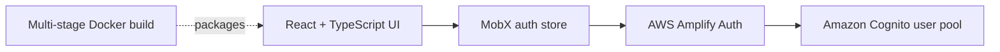

# Winter Cloud Dispatch System

[](https://github.com/beaprogram/Winter-Cloud-Dispatch-System/actions/workflows/ci.yml)

A React and TypeScript authentication prototype for a future cloud dispatch interface. The current repository demonstrates AWS Cognito sign-up, sign-in, confirmation, sign-out, and custom-challenge handling with MobX state management.

## Current scope

Implemented:

- Cognito email sign-up and confirmation.
- Sign-in and sign-out with AWS Amplify.
- Custom authentication challenge handling for security questions and a Caesar-cipher exercise.
- MobX-backed view and form state.
- A reproducible static production build and Nginx container image.

Not implemented:

- Dispatch jobs, drivers, vehicles, routes, scheduling, or operational dashboards.
- A backend API or persistent dispatch data model.
- A hosted public demo.
- Automated component tests beyond the Create React App test harness.

Calling this repository an authentication prototype keeps the presentation aligned with the code that exists today.

## Architecture



## Run locally

Requires Node.js 20+ and an AWS Cognito user pool configured for the authentication flow used by the project.

```bash
git clone https://github.com/beaprogram/Winter-Cloud-Dispatch-System.git
cd Winter-Cloud-Dispatch-System
yarn install --frozen-lockfile
yarn start
```

The current Cognito pool identifiers live in `src/auth/amplifyConfig.ts`. For a reusable deployment, replace them with identifiers for your own pool and avoid adding client secrets to a browser application.

## Build and container

```bash
yarn build

docker build -t winter-cloud-dispatch-system .
docker run --rm -p 8080:80 winter-cloud-dispatch-system
```

Open `http://localhost:8080` for the containerized build.

## Verification

GitHub Actions runs a locked dependency install and production build on pull requests and pushes to `main`.

```bash
yarn install --frozen-lockfile
yarn build
```

## Roadmap

If this project continues, the next meaningful milestone is a small, tested dispatch domain: create a job, assign a driver, transition status, and display an audit trail. Add that behavior before expanding the README's product claims.

## License

No open-source license has been selected.
